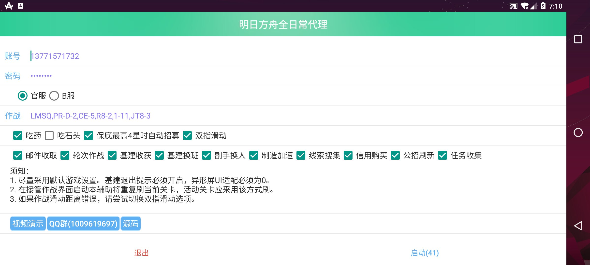

# 明日方舟速通

节点精灵实现的明日方舟全日常辅助，适配多种分辨率，等待耗时极低。[视频演示](https://www.bilibili.com/video/BV1DL411t7n2)。有问题请提issue或加群反馈。


## 须知

1. 尽量采用默认游戏设置。基建退出提示必须开启，异形屏UI适配必须为0。
1. 在接管作战界面启动本辅助将重复刷当前关卡，活动关卡应采用该方式刷。
1. 如果作战滑动距离错误，请尝试切换双指滑动选项。

## 特点

1. 支持明日方舟官服与B服。
1. 支持常见真机、云手机及模拟器（安卓7至11，DPI>=320，分辨率>=720x1280，长宽比>=16:9）。
1. 支持热更新。免root。极低等待耗时，快过手操。
1. 不支持多帐号，不支持基建指定排班干员，不支持无人机加速贸易站，不支持赠送寻访，不检测代理失误。

## 安装

下载[明日方舟速通](https://github.com/tkkcc/arknights/releases/latest/download/arknightsspeedrun.apk)，或在[节点精灵](http://card.nspirit.cn/getApk)，搜索5963。均为自动更新。

## 开发

参考[节点精灵开发文档](http://www.nspirit.cn/api)。命令行用户可以使用仓库中的`./0.sh`开发：例如通过`./0.sh saverun`上传代码并运行。

## 其他辅助（awesome-arknights-auto-helper）

### 板载

1. [明日方舟月明](https://www.aistool.com/)：适配1280x720分辨率已root设备，支持多帐号，支持国服日服，支持基建指定排班干员，完成度极高，但部分功能等待耗时较多，使用飞天助手实现。
1. [明日计划](https://space.bilibili.com/271091178/video)：适配异形屏，免root，但还未支持16:9屏幕，完成度还不足，等待耗时较多，使用autojs实现。
1. [arkayo](https://github.com/mslxl/arkayo)：适配多分辨率，完成度还不足，等待耗时较多，使用autojs实现。
1. [PRTS](https://github.com/AgainstEntropy/PRTS)：完成度还不足，使用autojs实现。
1. [明日方舟托管助手](https://www.bilibili.com/video/BV1kA41147HA)：适配异形屏，但未适配红手指，等待耗时较多，收费，使用节点精灵实现。
1. [明日方舟全日常辅助](https://github.com/tkkcc/arknights/tree/xxzhushou)：不再更新，只适配安卓8以下1920x1080分辨率已root机型，使用叉叉助手实现，本工具前身。
1. [基于按键精灵安卓版的明日方舟脚本](https://github.com/Lancarus/a-mobile-anjian-script-for-arknight)：支持多账号，完成度高，但“为了适应云手机破烂的性能加大了很多地方的延时”。

### 非板载（需PC算力）

1. [ArknightsAutoHelper](https://github.com/ninthDevilHAUNSTER/ArknightsAutoHelper)：使用python实现。
1. [arkHelper](https://github.com/MangetsuC/arkHelper)：使用python实现。
1. [MeoAssistance](https://github.com/MistEO/MeoAssistance)：使用C#实现。
1. [ArknightsAutoHelper](https://github.com/GreenSulley/ArknightsAutoHelper)：使用python实现，by GreenSulley。
1. [Arknights-Sora](https://github.com/zsppp/Arknights-Sora)：使用python实现。

### 其他辅助平台（2021年7月测试）：

1. 游戏蜂窝（按键精灵）：最新的2个脚本在2021年7月更新，收费，在红手指上试用时等待耗时极高。
1. 触动精灵：最新的2个脚本在2021年5月更新，收费，在红手指上试用时未正常工作。
1. 自动精灵：脚本较多，免费，完成度普遍较低。

## 每日任务速通

### 记录

- [39.75s！明日方舟每日任务速刷突破40s](https://www.bilibili.com/video/BV1Ky4y1572P)
- [44.12秒！再次突破记录！明日方舟每日任务速通再次突破【any%】](https://www.bilibili.com/video/BV1zh411i7ea)
- [【明日方舟】【TAS】每日任务速通52.22秒失败记录](https://www.bilibili.com/video/BV1i44y1k7Nx)
- [1分57秒！【明日方舟】每日任务速通极限再突破！](https://www.bilibili.com/video/BV1P341167fe)

### 使用

测试中

1. 仅勾选"每日任务速通"或"每日任务速通"，在"开始唤醒"界面运行

### 理论

[日常任务](http://prts.wiki/w/%E4%BB%BB%E5%8A%A1%E5%88%97%E8%A1%A8)中，排除作战类任务后还剩
```txt
1 进行1次干员强化
1 从信用商店收取1次信用
1 在信用商店中购买任意商品1次
1 完成1次公开招募
2 完成3次公开招募
1 在基建内与干员进行5次增加信赖的互动
1 在基建内与干员进行10次增加信赖的互动
1 累计收取1次制造站的制造产物
1 完成1笔订单
1 完成5笔订单
1 完成10笔订单
2 完成20笔订单
1 让1名干员在宿舍中恢复心情
1 让5名干员在宿舍中恢复心情
2 让10名干员在宿舍中恢复心情
1 访问1次好友的基建
```
其中，左侧一列为印章数，总和19，而完成每日任务需要18，因此只能少做其中一个，排除有后续阶段任务的还剩下
```txt
1 进行1次干员强化
1 从信用商店收取1次信用
1 在信用商店中购买任意商品1次
1 累计收取1次制造站的制造产物
1 访问1次好友的基建
```
排除其中一个使总耗时最低。
本工具排除的是 访问1次好友的基建，但目前最快记录排除的是 进行1次干员强化。
需要再研究下。

