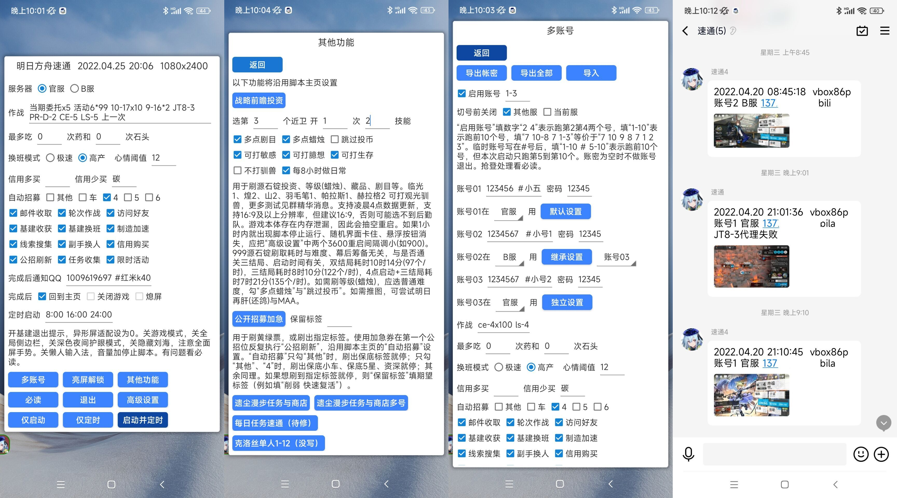

<h1 align="center"> ArkLights</h1>

<p align="center">
ArkLights is the <b> lightning fast</b> and <b> fully managed</b> Arknights game helper</a>
</p>

<p align="center">明日方舟速通 —— 高效的明日方舟全托管APP</a> </p>


<p align="center" >
<a href=https://arklights.pages.dev>使用文档</a>
<a href=https://www.bilibili.com/video/BV11T4y1S7cj>999源石锭速刷记录7时21分</a>
<a href=https://www.bilibili.com/video/BV1eQ4y1C7Ch>每日任务速通记录35.25s</a>
<a href=https://arklights.pages.dev/guide.html#%E4%BA%91%E7%AB%AF%E6%8E%A7%E5%88%B6>云控平台</a>
</p>



### Development

1. 内置函数参考[懒人精灵无障碍模式IDE](http://bbs.lrappsoft.com/forum.php?mod=forumdisplay&fid=2)内文档

1. 调试

    懒人精灵中新建项目main，利用saverun转码为项目文件后调试
    ```sh
    # in linux
    ./0.sh saverun
    # in windows
    python3 ./0.py saverun
    ```
    调试时在main.lua中启用日志
    ```txt
    always_enable_log
    ```

1. 发布
    ```sh
    # in linux
    ./0.sh release
    # in windows
    python3 ./0.py release
    ```
    
1. 数据提取
    ```sh
    # 解包
    ./0.sh extract
    # 提取基建图标数据
    ./0.sh buildingskill
    # 提取公招保底组合
    ./0.sh recruit
    # 提取活动关卡坐标
    ./extracy.py screencap 1,2,3
    ./extracy.py screencap_distance
    ```

<!-- ### Star History -->
<!---->
<!-- [](https://star-history.com/#tkkcc/ArkLights&ArknightsAutoHelper/ArknightsAutoHelper&MaaAssistantArknights/MaaAssistantArknights&Date) -->

